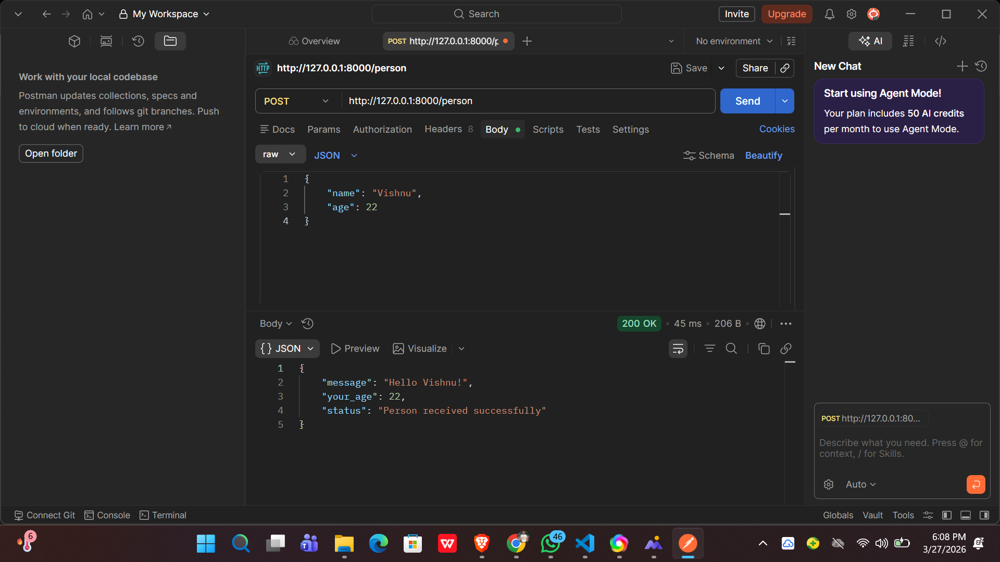

# Day 4 - Postman Testing

## What is Postman?
Postman is a tool used to test APIs without writing any code.
Instead of typing URLs in the browser, Postman lets you send
GET, POST, PUT requests and see the responses clearly.

## What I tested
All APIs built in Day 1, Day 2, and Day 3 were tested using Postman.

---

## Day 1 - Basic API Tests

| Method | URL | Expected Response |
|--------|-----|------------------|
| GET | http://127.0.0.1:8000/ | Welcome message |
| GET | http://127.0.0.1:8000/hello | Hello message |

---

## Day 2 - GET API Tests

| Method | URL | Expected Response |
|--------|-----|------------------|
| GET | http://127.0.0.1:8000/greet?name=Vishnu | Hello Vishnu |
| GET | http://127.0.0.1:8000/add?a=5&b=10 | result: 15 |

---

## Day 3 - POST API Tests

| Method | URL | Body |
|--------|-----|------|
| POST | http://127.0.0.1:8000/person | name and age in JSON |

### Sample JSON body used for POST /person
{
    name: Vishnu,
    age: 22
}

### Response received
{
    message: Hello Vishnu!,
    your_age: 22,
    status: Person received successfully
}

---

## How to use Postman

Step 1 - Download Postman from https://www.postman.com/downloads
Step 2 - Open Postman and click New Request
Step 3 - Select GET or POST method
Step 4 - Enter the URL
Step 5 - For POST requests click Body, select raw, choose JSON
Step 6 - Type your JSON data
Step 7 - Click Send
Step 8 - See the response at the bottom

---

## Key Difference - Browser vs Postman

Browser    - can only do GET requests
Postman    - can do GET, POST, PUT, DELETE requests
Postman    - shows status codes clearly (200, 404, 422)
Postman    - easy to send JSON body for POST requests

I am Attaching Screenshots of The Output Also
